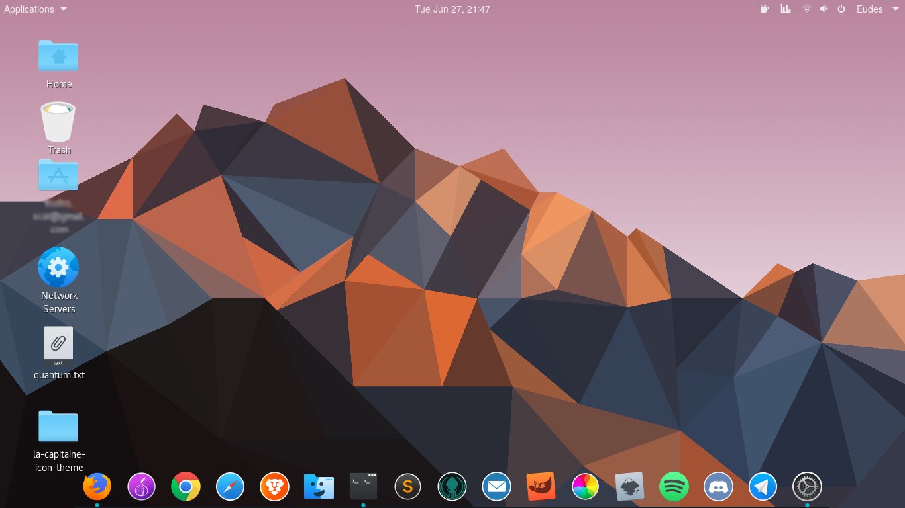
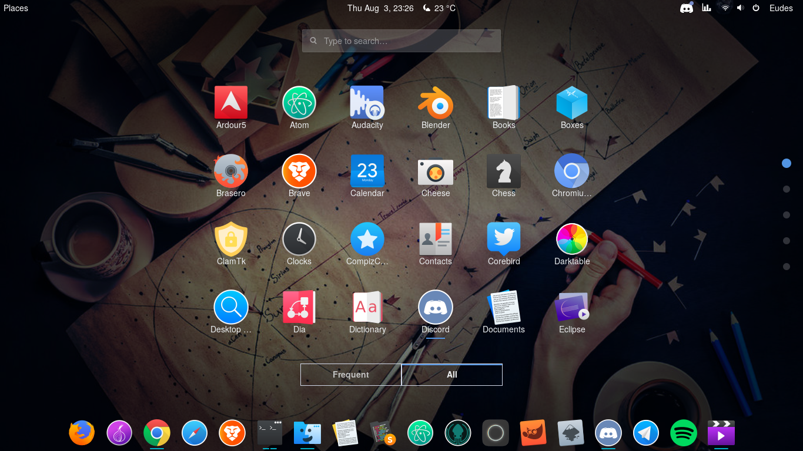
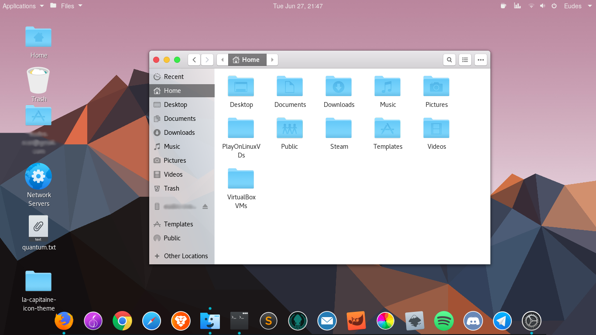

### Personal custom settings
I mix of things I set up for my GNOME

* OSX-Arc-Darker: https://github.com/LinxGem33/OSX-Arc-Darker
* Gn-OSX H.Sierra: https://www.gnome-look.org/p/1180505/show/page/1
  * Modified the gtk.css file using configurations from OSX-Arc.

* macOS iCons: https://www.gnome-look.org/p/1102582/
* la-capitaine-icon-theme: https://github.com/keeferrourke/la-capitaine-icon-theme
  * Most apps icons are from la-capitaine, with a few from macOS iCons. The folders in nautilus are also from macOS iCons.

